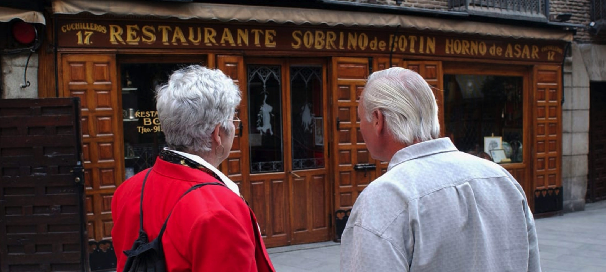
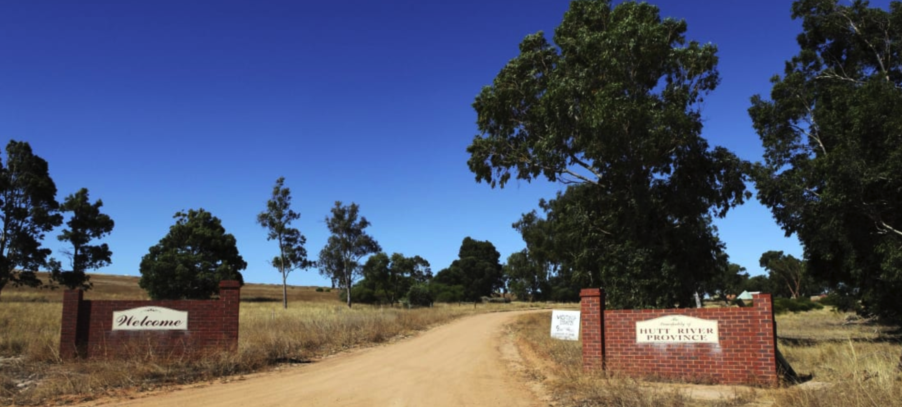
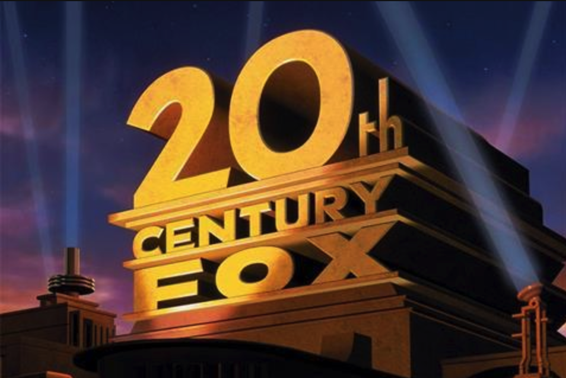
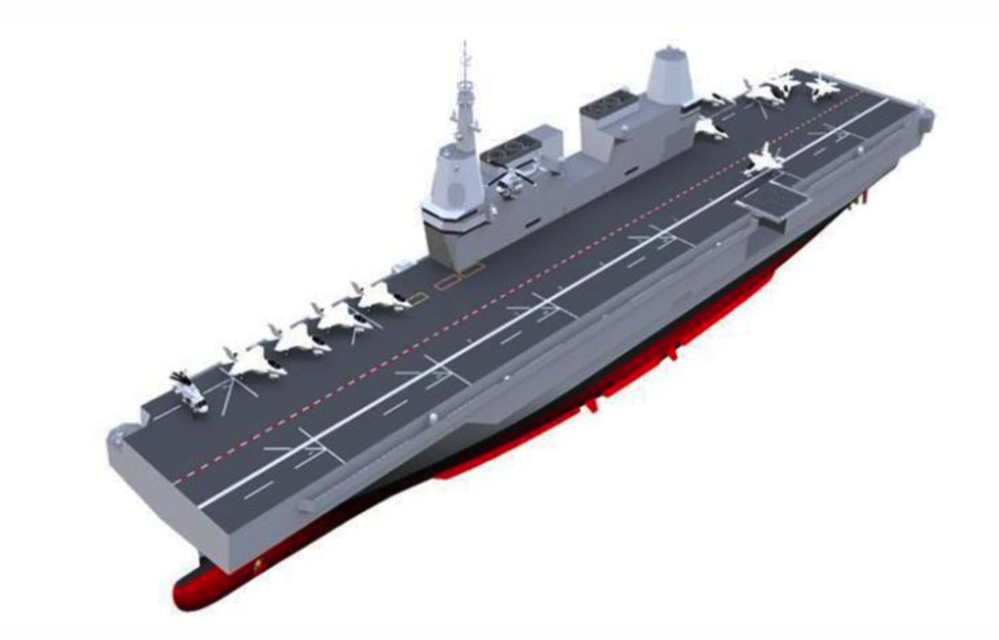
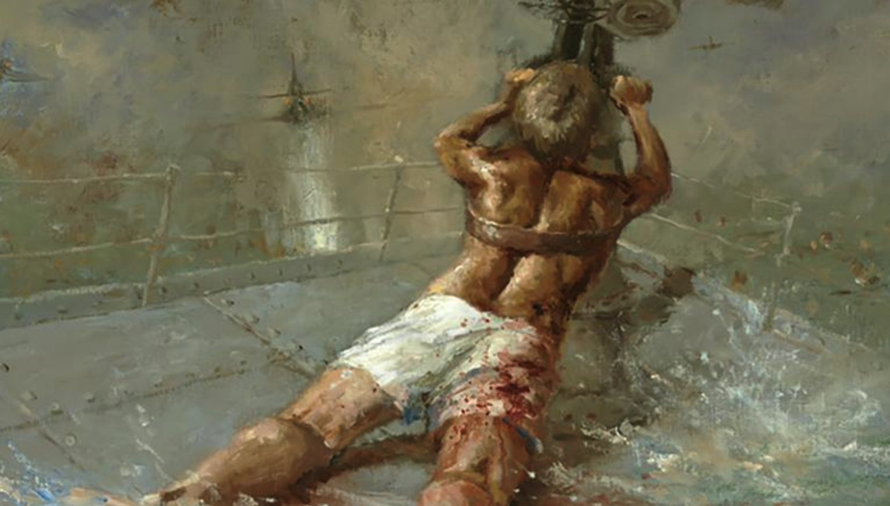

## 世界上最老的餐厅面临关闭

Botin餐厅，创立于1725年的西班牙餐厅，因为疫情原因一度关门。现在客流量非常少，经营者正在想法设法，摆脱关闭的风险。

## 澳大利亚最古老的国中国将消失

Hutt River，坐落于一个75平方公里的农场，由一位叫Leonard Casley的王子创立于1970年；

它发行自己的钱币，邮票，护照，签证，主要收入来源是旅游观光。

目前由于新冠疫情影响，旅游下降，继承人不得不出售农场，以偿还债务。

有趣的是，该国曾于1977年，因税收问题，向澳大利亚宣战。

## 20世纪福克斯品牌将成为历史

迪士尼从fox收购了“20th Century Fox”后，决定将其更名为“20th Century Studios”；同样更名的还有电视品牌“20th Century Fox Television”，被改名为“20th Television”。

改名的原因是，迪士尼并没有把fox的所有品牌产品都收购，比如Fox Sports, Fox News等。为了避免市场和用户困扰，迪士尼决定把收购过来的品牌，去掉Fox字符。

## 人类所追求的目标和付出的代价
一个人的生活是一个整体，可以切分为两部分：
* 一部分是他从未体验过的（比如去火星），我们称为A部分；
* 另外一部分是已经体验过的（比如吃饭，用洗衣机洗衣服，吹空调），我们称为B部分。

人类都在追寻自己未体验过的那部分（A部分）；而为了实现这个目标，必须得生存下去，为了生存，就必须不断重复已经体验过的那部分（B部分）。

不管体验哪部分，都得成本，都得金钱。区别在于花的钱多少而已。

钱从哪里来呢？钱，从制造生活的两部分而来。

有的人在制造B部分，换得一些小钱；而有的人在制造A部分，收获一笔大钱。

前者就是普罗大众，每天在辛苦劳作，通过积累的钱，偶尔可以去体验生活的A部分；后者就是牛人，通过发明创造，积累了大笔财富，可以随时体验生活的A部分。

但愿你能称为后者；如果不能，做个普通幸福的前者吧。

## 韩国将建造航母

鉴于南海局势，韩国国防部正式宣布，明年将建造一艘航母。

## 78年后，被授予国家最高军人勋章

二战期间，澳大利亚18岁的海军 Edward Sheean，在大腿受伤的情况下，把自己绑在护卫舰机炮上，一直朝日本飞机射击。

船沉入海面以下后， Edward Sheean仍然在射击；许多船员回忆，子弹从水面下Sheean的机炮中射出来，最终击落两架敌机。

澳大利亚国内曾于1942-43, 2013，2019年四次提议，给Edward Sheean颁发勋章；直到今天，才最终授予。