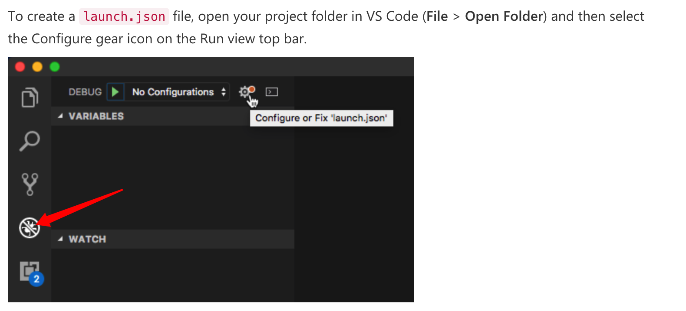
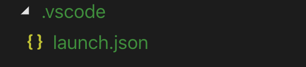
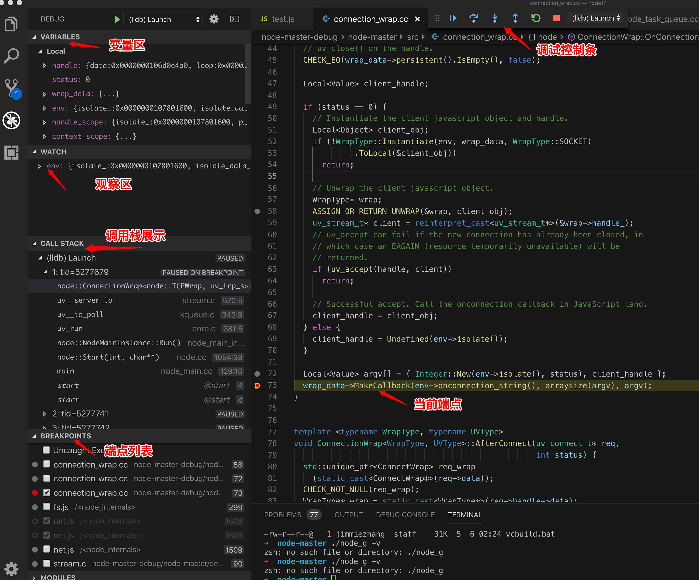

# nodejs core调试
声明，本文特指使用vscode,调试nodejs native模块，比如/src/connection_wrap.cc代码。业务js代码调试，可参见nodejs官网调试。

## step1,下载nodejs源码安装包
打开github上的仓库（https://github.com/nodejs/node），克隆到本地

```js
git clone https://github.com/nodejs/node.git
```

## step2, 编译nodejs
本文以macos为例。

编译前需要安装：（详见[build工具](https://github.com/nodejs/node/blob/master/BUILDING.md)）
* Xcode Command Line Tools >= 10 for macOS
* Python (see note above)
    * Python 2.7
    * Python 3.5, 3.6, 3.7, and 3.8.


在刚才clone的node路径下，执行以下两个命令（耗时较长，大概需要10-30分钟）。
* ./configure
* make -j4

编译好后，会在当前目录下，新增一个out目录，编译后的node存放在out/Release/node。

## step3, 验证编译
在当前目录下，执行一下命令
```js
out/Release/node -v
```

如果能正确显示node的版本，那么证明nodejs编译成功。

## step4, 开始调试

用vscode打开刚才的node目录, 添加launch.json文件。方式如下：


vscode会在当前目录下，生成一个launch.json文件。


打开该文件，按照以下格式填写
```js
{
    // Use IntelliSense to learn about possible attributes.
    // Hover to view descriptions of existing attributes.
    // For more information, visit: https://go.microsoft.com/fwlink/?linkid=830387
    "version": "0.2.0",
    "configurations": [
        {
            "name": "(lldb) Launch",
            "type": "lldb",
            "request": "launch",
            "program": "{workspace}/out/Release/node", // 请填写绝对路径
            "args": [
              "--expose-internals",
              "{workspace}/test.js" // 建议填写绝对路径，告诉vscode启动文件
            ],
            "stopAtEntry": false,
            "cwd": "{workspace}/out/Release/", // 请填写绝对路径
            "environment": [],
            "externalConsole": true,
            "MIMode": "lldb"
          }
    ]
}
```

然后新增一个test.js文件，用于调试，你可以直接用下面的内容：

```js
const net = require('net');
// 2.创建一个服务
const server = net.createServer((c) => {
  // 'connection' listener.
  console.log('client connected');
  c.on('end', () => {
    console.log('end');
  });
  c.on('data', () => {
      console.log('data event');
      c.write('HTTP/1.1 200 OK\r\n');
        c.write('Connection: keep-alive\r\n');
        c.write('Content-Length: 12\r\n');
        c.write('\r\n');
        c.write('hello world!');
  })
});
server.on('error', (err) => {
  throw err;
});
// 3.监听端口
server.listen(9090, () => {
  console.log('server bound');
});
```

一切准备就绪，点击vscode顶部的  “Debug->Start Debugging(F5)”, vscode自动启动debug面板。

你可以在vscode中打开一个文件，比如connection_wrap.cc, 用鼠标加一个端点。

然后用浏览器访问http://localhost:9090/, vscode会自动将程序停止在端点处。


