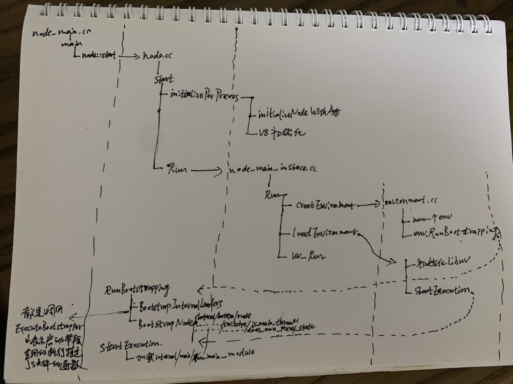

事先声明：本文分析基于nodejs 14版本; 
[TOC]
# nodejs进程启动流程探析

本文将分析nodejs进程启动的全流程，但不包括后续的请求处理流程。
>（注：本文主要是借助“vscode+lldb”进行断点分析的）

## nodejs启动入口
nodejs是用C++开发的，因此它启动的入口在node_main.cc中。

```js
int main(int argc, char* argv[]) {
  ...
  return node::Start(argc, argv);
  ...
}
```

可以看到，其实是通过node::Start来启动。

## node::Start

node::Start在/src/node.cc中。我们看下他的代码。

```js
int Start(int argc, char** argv) {
  InitializationResult result = InitializeOncePerProcess(argc, argv);
  ...

  {
    ...

    NodeMainInstance main_instance(&params,
                                   uv_default_loop(),
                                   per_process::v8_platform.Platform(),
                                   result.args,
                                   result.exec_args,
                                   indexes);
    result.exit_code = main_instance.Run();
  }

  TearDownOncePerProcess();
  return result.exit_code;
}
```

可以看到，主要分为两部分，InitializeOncePerProcess()和main_instance.Run()。

这里，作者先透漏一下这两部分的作用：

* InitializeOncePerProcess： 每个进程初始化一次，主要是
  * 注册build-in模块（即用C++写的模块，比如/src/tcp_wrap.cc）
  * 初始化v8

> 简单来说，就是把C++模块注册好，以供后续调用。

* main_instance.Run: 
  * 初始化环境（创建一个env，后续都会用到这个变量）；
  * 加载环境中指定的东西，即加载app.js（实际上很复杂，我们后续一一分析），并执行；
  * 启动完成，并把uv_run跑起来。

> 简单来说，就是把内置的js模块准备好，并允许业务的js代码。

我们先看下整体的调用图：

## InitializeOncePerProcess探析

那我们就来看下，nodejs启动两大步（InitializeOncePerProcess和main_instance.Run）中的第一步InitializeOncePerProcess干了啥。

## main_instance.Run探析

那我们就来看下，nodejs启动两大步（InitializeOncePerProcess和main_instance.Run）中的第二步main_instance.Run干了啥。

### loaders
在main_instance.Run中，创建完env后，执行的env.RunBootstrapping中，分为两大步

* BootstrapInternalLoaders: 启动/lib/internal/bootstrap/loaders.js
* BootstrapNode： 启动/lib/internal/bootstrap/node.js

/lib/internal/bootstrap/loaders.js是干啥的呢？

首先明确以下概念：

* process.binding: 历史遗留的buildin模块的绑定方法，现在基本不建议用。
* process._linkedbinding: 用户自己开发的C++ addons
* internalbinding: 新的build-in module绑定方法，也就是process.binding的替代者。不过这个方法用户不可见。

从源码可以看出，process.binding就是在调用internalBinding

```js
process.binding = function binding(module) {
    module = String(module);
    // Deprecated specific process.binding() modules, but not all, allow
    // selective fallback to internalBinding for the deprecated ones.
    if (internalBindingWhitelist.has(module)) {
      return internalBinding(module);
    }
    // eslint-disable-next-line no-restricted-syntax
    throw new Error(`No such module: ${module}`);
  };
```