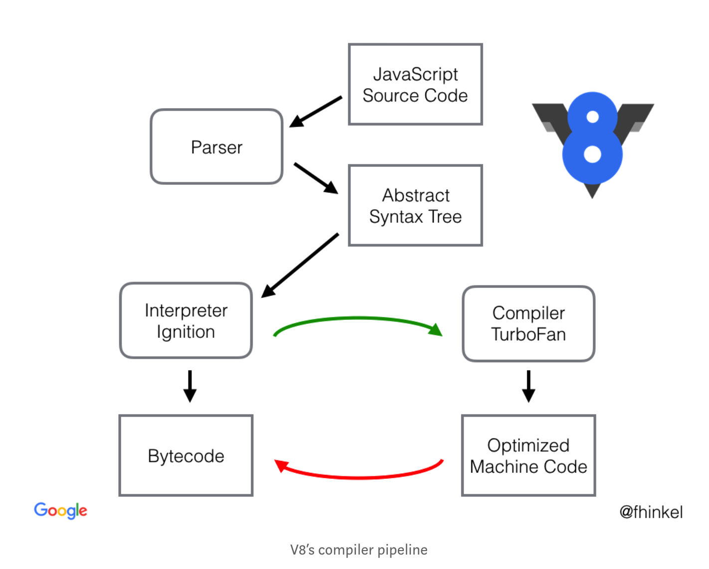

...整理中...

[TOC]

v8涉及的概念
* handle
* context
* template

# v8 如何工作


现在的v8由四部分组成
* parser
* ignition
* turbofan
* orinoco

工作流程如下：

1. 先用parser将script转化为ast
2. 然后用ignition将ast转化为bytecode，并直接编译执行；（同时收集一定的信息）
3. 如果一个函数被频繁调用，那么turbofan将bytecode优化（即optimized machine code），当下次调用时，直接用优化后的编译码来执行。

# v8 template

包含function template和object template。

我们来看下如何暴露C++函数和对象给js调用。

## Accessing dynamic variables

首先创建一个obj template，设置好SetAccessor和GetAccessor;

然后创建一个obj template的实例，并将该实例的一个内部属性（SetInternalField(index, External(C++对象))）。

接下来，你可以，你可以在context中，通过操作该obj template的实例的x（事先通过SetAccessor设定好的），来获取GetInternalField(index)拿到External(C++对象)。然后再通过External(C++对象)->Value()就是C++对象了。

每一个script的运行，必须在一个context下。而这个context的创建如下：

```js
// 先看样例，创建一个context
v8::Persistent<v8::Context> context =
    v8::Context::v8::New(isolate, nullptr, global_templ);

// 接下来看看底下的代码做了啥？
// /deps/v8/src/api/api.cc 
// 入参global_templ，变成这里的global_object
Local<Context> v8::Context::New(
    v8::Isolate* external_isolate, v8::ExtensionConfiguration* extensions,
    v8::MaybeLocal<ObjectTemplate> global_template,
    v8::MaybeLocal<Value> global_object,
    DeserializeInternalFieldsCallback internal_fields_deserializer,
    v8::MicrotaskQueue* microtask_queue) {
  return NewContext(external_isolate, extensions, global_template,
                    global_object, 0, internal_fields_deserializer,
                    microtask_queue);
}

Local<Context> NewContext(
    v8::Isolate* external_isolate, v8::ExtensionConfiguration* extensions,
    v8::MaybeLocal<ObjectTemplate> global_template,
    v8::MaybeLocal<Value> global_object, size_t context_snapshot_index,
    v8::DeserializeInternalFieldsCallback embedder_fields_deserializer,
    v8::MicrotaskQueue* microtask_queue) {
  ...
  i::Handle<i::Context> env = CreateEnvironment<i::Context>(
      isolate, extensions, global_template, global_object,
      context_snapshot_index, embedder_fields_deserializer, microtask_queue);
  ...
  return Utils::ToLocal(scope.CloseAndEscape(env));
}

// global_object变成了这里的maybe_global_proxy，从字面意思可以看出，是把这个对象当做了C++设置的一个代理，通过这个代理，可以让js访问C++里面的内容

// 在这个函数了，最终把global_object转换成了JSGlobalProxy
static i::Handle<ObjectType> CreateEnvironment(
    i::Isolate* isolate, v8::ExtensionConfiguration* extensions,
    v8::MaybeLocal<ObjectTemplate> maybe_global_template,
    v8::MaybeLocal<Value> maybe_global_proxy, size_t context_snapshot_index,
    v8::DeserializeInternalFieldsCallback embedder_fields_deserializer,
    v8::MicrotaskQueue* microtask_queue) {
  i::Handle<ObjectType> result;

  {
    ...
    i::MaybeHandle<i::JSGlobalProxy> maybe_proxy;
    if (!maybe_global_proxy.IsEmpty()) {
      maybe_proxy = i::Handle<i::JSGlobalProxy>::cast(
          Utils::OpenHandle(*maybe_global_proxy.ToLocalChecked()));
    }
    // 通过调用Invoke激活
    // Create the environment.
    InvokeBootstrapper<ObjectType> invoke;
    result = invoke.Invoke(isolate, maybe_proxy, proxy_template, extensions,
                           context_snapshot_index, embedder_fields_deserializer,
                           microtask_queue);
    ...
  }
  // Leave V8.

  return result;
}
```
## ignition和bytecode

### 启动程序是怎么工作的，内存如何分配。
一个编译好后的文件，下载到电脑上，比如放在~/Documents/someapp下。

启动后，电脑启动一个进程，将硬盘~/Documents/someapp下的可执行代码文件加载到内存中的一块区域A，这个区域可以理解为代码存储区，也就是栈内存区域。

这个A区域，是按照代码顺序存储的，cpu依次将一个一个代码执行。

一般程序的前半段都是数据内存分配，比如：int a = 1;这样的变量分配。这一块区域我们成为B，是数据内存区，也可以理解为堆，与代码区域A不同。

随着代码的继续执行，比如执行到 “int c = a + b;"这个句，程序首先：
* 将数据内存区B中a代表的内存地址中的数据取出，放到accumulator中；
* 然后将accumulator中的数据转到寄存器R0中。
* 接着讲内存区B中b代表的内存地址中的数据取出，放到accumulator中。
* 接着调用一个关键字，比如 addExpress,这个指令会accumulator+R0,就实现了a+b的运算。
* 实际运行可能有差异，accumulator可能承担不同的角色。

### v8中的ignition和turbofan
* 将源码转为ast
* interpreter中的bytecodegenerator遍历走查ast中的每一个节点，对每一个节点，生成对应的bytecodes(可能一个节点或者边缘会生成多个bytecode语句)

生成的bytecode将会是后续所有步骤的source of truth。包括反优化等，都是直接从bytecode，而不用再从source code再parse成ast。

有了bytecode，接下来第一次执行，将由ignition这个interpreter的另外一部分完成（interpreter包含两部分功能，一部分用于将ast生成bytecode，另外一部分就是消费执行bytecode）

* interpreter,按照调用时编译，按照逐个编译执行bytecode（其实背后就是用了turbofan这个编译器进行逐个编译）,同时收集运行信息给v8。
* 如果是执行不同的函数，那么ignition将充当主角。
* 随着函数的执行，v8收集到了足够的信息，判定某个函数比如add(x, y)接受的总是数字，那么就会触发一次整体编译（相对于未优化时的逐句编译），并存储起来（这样就变成了事前编译，这也就是为什么turbofan是compiler，而非interpreter）
* 接着代码调用了add(1,3), 此时v8的控制器将不再走ignition这个interpreter，而是直接调用之前turbofan编译好的机器码执行，速度提升非常快。
* 当然，turbofan编译后的源码，插入了兜底检测机制，如果检测到参数不是smallint，将会触发deoptimize流程，即重新走ignition这条路。（相对于一开始走ignition，这里将多了执行源码的过程，因此造成了浪费现象）。

### nodejs中的js代码如何被执行呢？

首先，nodejs是标准的c++程序，它启动后，是执行标准的C++代码。

等到env.RunBootstrapping这一步时，会加载js代码并执行，我们来看下它的步骤。

* 首先将js代码从硬盘中读取
* C++线程跳转到编译js的函数处，将js源码parse为ast，并在数据内存区B存放起来。
* 接着跳转到“生成bytecode”的函数处，将ast转为bytecode，并存放在数据内存区B中。
* 接着跳转到“生成源码”的函数处，将bytecode编译为汇编码最终生成机器码，并存放在代码内存区A的某个地方。
* 接着跳转到刚才生成的代码内存区A的那个地方，执行。执行的时候，可能会export出一个新的函数，这个新函数同样也会保存在代码内存区A某个地方。
* 比如加载/lib/internal/bootstrap/loaders.js执行后，还会宝露出nativeModuleRequire和internalBinding两个函数。这两个函数会存放在内存代码区A的某个地方
* 接着当运行其他js函数时，首先会把js源码转为机器码，我们此时可以把它当做普通的C++函数，然后传入以前生成的nativeModuleRequire和internalBinding，完成调用。

这就是c++编译js并执行的过程。