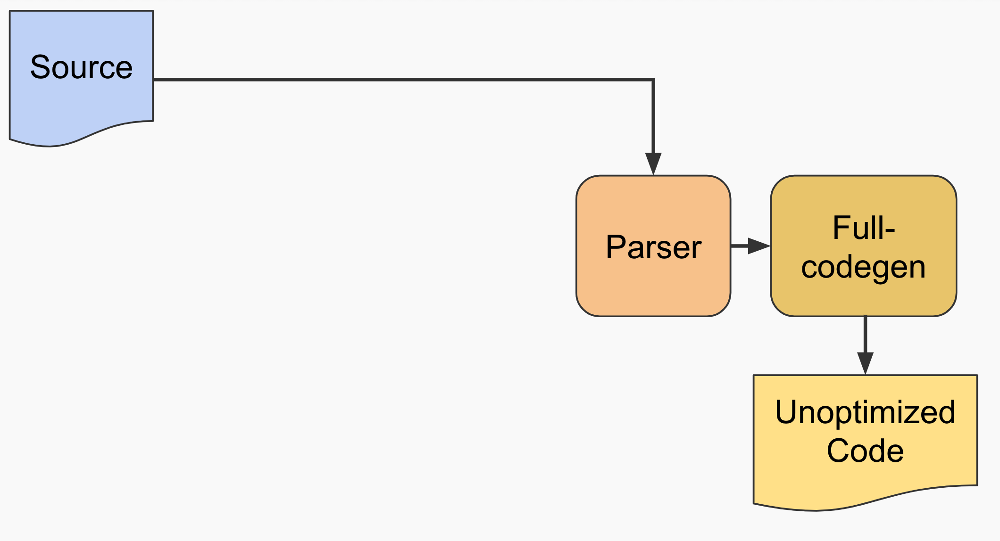
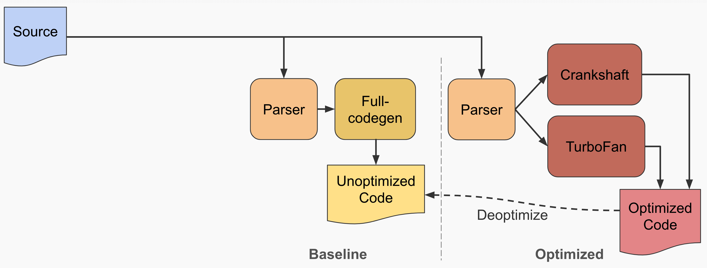
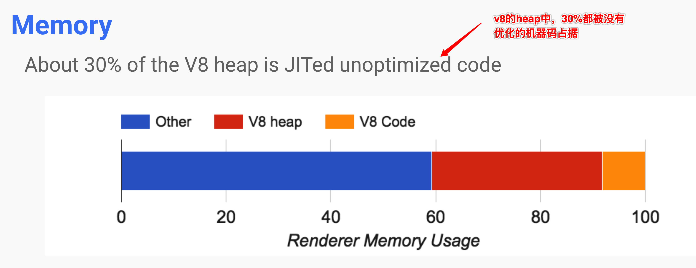
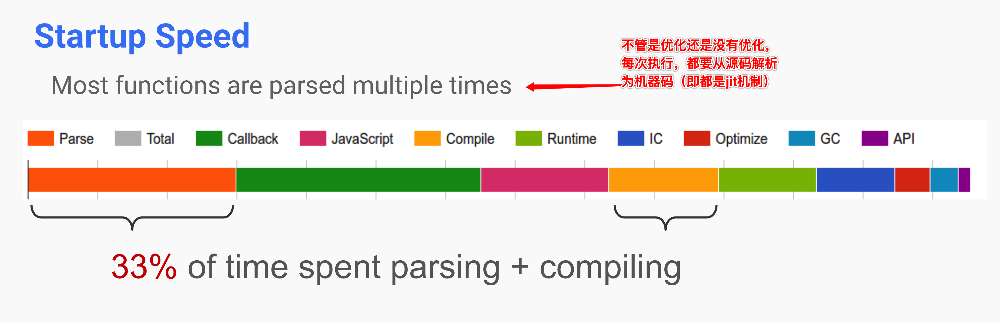
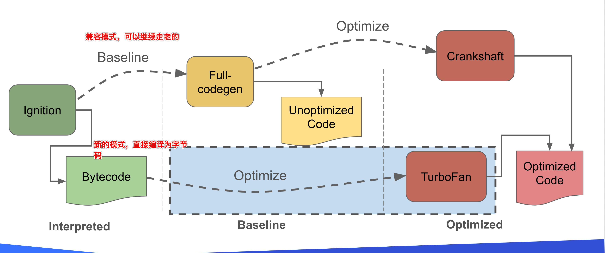
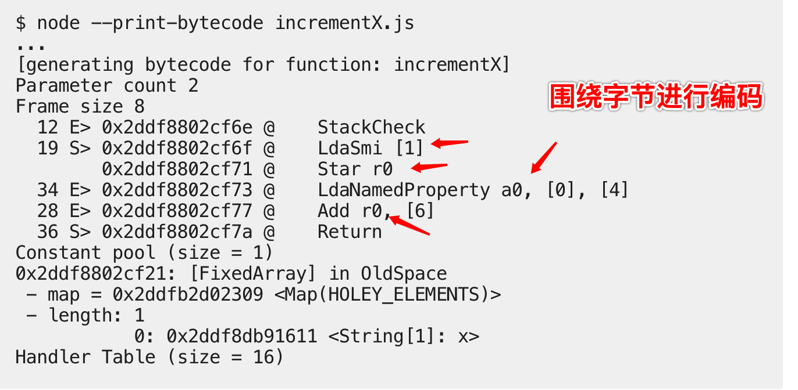

...整理中...

[TOC]

v8涉及的概念
* handle
* context
* template

# v8 如何工作


现在的v8由四部分组成
* parser
* ignition
* turbofan
* orinoco

工作流程如下：

1. 先用parser将script转化为ast
2. 然后用ignition将ast转化为bytecode，并直接编译执行；（同时收集一定的信息）
3. 如果一个函数被频繁调用，那么turbofan将bytecode优化（即optimized machine code），当下次调用时，直接用优化后的编译码来执行。

# v8 template

包含function template和object template。

我们来看下如何暴露C++函数和对象给js调用。

## Accessing dynamic variables

首先创建一个obj template，设置好SetAccessor和GetAccessor;

然后创建一个obj template的实例，并将该实例的一个内部属性（SetInternalField(index, External(C++对象))）。

接下来，你可以，你可以在context中，通过操作该obj template的实例的x（事先通过SetAccessor设定好的），来获取GetInternalField(index)拿到External(C++对象)。然后再通过External(C++对象)->Value()就是C++对象了。

每一个script的运行，必须在一个context下。而这个context的创建如下：

```js
// 先看样例，创建一个context
v8::Persistent<v8::Context> context =
    v8::Context::v8::New(isolate, nullptr, global_templ);

// 接下来看看底下的代码做了啥？
// /deps/v8/src/api/api.cc 
// 入参global_templ，变成这里的global_object
Local<Context> v8::Context::New(
    v8::Isolate* external_isolate, v8::ExtensionConfiguration* extensions,
    v8::MaybeLocal<ObjectTemplate> global_template,
    v8::MaybeLocal<Value> global_object,
    DeserializeInternalFieldsCallback internal_fields_deserializer,
    v8::MicrotaskQueue* microtask_queue) {
  return NewContext(external_isolate, extensions, global_template,
                    global_object, 0, internal_fields_deserializer,
                    microtask_queue);
}

Local<Context> NewContext(
    v8::Isolate* external_isolate, v8::ExtensionConfiguration* extensions,
    v8::MaybeLocal<ObjectTemplate> global_template,
    v8::MaybeLocal<Value> global_object, size_t context_snapshot_index,
    v8::DeserializeInternalFieldsCallback embedder_fields_deserializer,
    v8::MicrotaskQueue* microtask_queue) {
  ...
  i::Handle<i::Context> env = CreateEnvironment<i::Context>(
      isolate, extensions, global_template, global_object,
      context_snapshot_index, embedder_fields_deserializer, microtask_queue);
  ...
  return Utils::ToLocal(scope.CloseAndEscape(env));
}

// global_object变成了这里的maybe_global_proxy，从字面意思可以看出，是把这个对象当做了C++设置的一个代理，通过这个代理，可以让js访问C++里面的内容

// 在这个函数了，最终把global_object转换成了JSGlobalProxy
static i::Handle<ObjectType> CreateEnvironment(
    i::Isolate* isolate, v8::ExtensionConfiguration* extensions,
    v8::MaybeLocal<ObjectTemplate> maybe_global_template,
    v8::MaybeLocal<Value> maybe_global_proxy, size_t context_snapshot_index,
    v8::DeserializeInternalFieldsCallback embedder_fields_deserializer,
    v8::MicrotaskQueue* microtask_queue) {
  i::Handle<ObjectType> result;

  {
    ...
    i::MaybeHandle<i::JSGlobalProxy> maybe_proxy;
    if (!maybe_global_proxy.IsEmpty()) {
      maybe_proxy = i::Handle<i::JSGlobalProxy>::cast(
          Utils::OpenHandle(*maybe_global_proxy.ToLocalChecked()));
    }
    // 通过调用Invoke激活
    // Create the environment.
    InvokeBootstrapper<ObjectType> invoke;
    result = invoke.Invoke(isolate, maybe_proxy, proxy_template, extensions,
                           context_snapshot_index, embedder_fields_deserializer,
                           microtask_queue);
    ...
  }
  // Leave V8.

  return result;
}
```
# interpreter and compiler

最开始，很多浏览器js引擎都是把js源码转为ast后，编译为字节码，然后再编译为机器源码（其实是编译为汇编码，然后才是机器码）。

这里可以看出，流程比较多。v8采用了一个激进的方式，直接将ast编译为机器源码，把字节码这个中间环节去掉了。




在当时（2010年左右），这的确带来了速度的大提升。可是随着js语言的更新，尤其是es6的发布，越来越多的语法，导致从源码直接编译为机器码这种做法越来越不适合。





这里特别之处，无论是老的fullcodegen，还是优化的turboban, 本质上都是jit，即直接从ast到源码。

如果每次调用相同的函数，都会经历这个阶段，并且一旦参数移动，优化后的机器码就得反优化，非常浪费。

因此，在新时代背景下，v8也采用了历史的引擎策略，重新引入字节码。



## 什么是字节码

字节码的初衷是，参考机器码的运行方式：

> Compiling bytecode to machine code is easier if the bytecode was designed with the same computational model as the physical CPU. This is why interpreters are often register or stack machines



这里可以大致看出，为什么取名叫bytecode： 对byte进行的编码。


